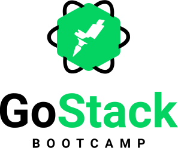

<!-- PROJECT SHIELDS -->
<!--
*** I'm using markdown "reference style" links for readability.
*** Reference links are enclosed in brackets [ ] instead of parentheses ( ).
*** See the bottom of this document for the declaration of the reference variables
*** for contributors-url, forks-url, etc. This is an optional, concise syntax you may use.
*** https://www.markdownguide.org/basic-syntax/#reference-style-links
-->
<!-- [![Contributors][contributors-shield]][contributors-url] -->
<!-- [![Forks][forks-shield]][forks-url] -->
<!-- [![Stargazers][stars-shield]][stars-url] -->
<!-- [![Issues][issues-shield]][issues-url] -->
[![MIT License][license-shield]][license-url]
[![LinkedIn][linkedin-shield]][linkedin-url]


<!-- PROJECT LOGO -->
<br />


<p align="center">


  
  <br />
  


  <h3 align="center"><strong>Meetapp</strong>: Backend</h3>

  <p align="center">
    Meetapp helps people to develop together!
    <!-- <br />
    <a href="#"><strong>Explore the docs »</strong></a>
    <br /> -->
    <br />
    <a href="#">View Demo</a>
  </p>
</p>


<!-- TABLE OF CONTENTS -->
## Table of Contents

- [Table of Contents](#table-of-contents)
- [About The Project](#about-the-project)
  - [Built With](#built-with)
  - [Coding Style](#coding-style)
- [Getting Started](#getting-started)
  - [Prerequisites](#prerequisites)
  - [Installation](#installation)
- [Usage (TODO)](#usage-todo)
- [Roadmap](#roadmap)
- [Contributing](#contributing)
- [License](#license)
- [Contact](#contact)
- [Acknowledgements](#acknowledgements)
<!-- - [License](#license) -->
- [Contact](#contact)
- [Acknowledgements](#acknowledgements)


<!-- ABOUT THE PROJECT -->
## About The Project

<!-- [![Product Name Screen Shot][product-screenshot]](https://example.com) -->

Meetapp is an application built as a final challenge in Rocketseat bootcamp. The project has 03 parts: Backend, Frontend and Mobile. Here we have the Backend's implementation.


### Built With
Tools used:
* [Node.js](https://nodejs.org)
* [Express](https://github.com/expressjs/express)
* [PostgreSQL](https://www.postgresql.org/) + [Sequelize (SQL ORM for Node.js)](https://github.com/sequelize/sequelize)
* [Docker](https://www.docker.com/)
* [Redis](https://redis.io/) + [Bee queue](https://github.com/bee-queue/bee-queue)
* [Sucrase](https://github.com/alangpierce/sucrase)
* [Nodemon](https://nodemon.io/)

### Coding Style

* We adopt [Airbnb JavaScript Style Guide](https://github.com/airbnb/javascript) in the project development together with [Editor Config](https://editorconfig.org/), [ESLint](https://eslint.org/) and [Prettier](https://prettier.io/). Ah, we also use [VSCode](https://code.visualstudio.com/) as the code editor.

<!-- GETTING STARTED -->
## Getting Started

To get a local copy up and running follow these simple steps.

### Prerequisites

It is necessary to have installed <a href="https://nodejs.org/en/" target="_blank">Node.js</a> (v10.16.0 LTS), <a href="https://yarnpkg.com" target="_blank">Yarn</a> (v1.19.1) and <a href="https://yarnpkg.com" target="_blank">Docker</a> (v19.03.3, build a872fc2f86) on your machine to install and execute the project. The versions mentioned were used during the project development and deploy.

### Installation

1. Clone the repository:
  ```bash
  git clone https://github.com/tukno/rocketseat-bootcamp-meetapp-backend.git
  ```

2. Enter in the project root directory:
  ```bash
  cd rocketseat-bootcamp-meetapp-backend
  ```

3. Install all the dependencies of the project using Yarn, run:
  ```bash
  yarn
  ```
  or
  ```bash
  yarn install
  ```

4. Create the docker containers for the database and redis queue (feel free to modify the containers names, passwords and port mapping, just remember to update the enviroment variables values in the <em>.env</em> file):

   4.1 Create the PostgreSQL container:
    ```bash
      docker run --name db_meetapp -e POSTGRES_PASSWORD=meetappdev -p 5432:5432 -d postgres
    ```
    4.2 Create the Redis container:
    ```bash
      docker run --name redis_meetapp -p 6379:6379 -d -t redis:alpine
    ```
5. Create and configure the project enviroment variables in the <em>.env</em> file. You can check the <em>[.env.example](/.env.example)</em> file provided that contains the necessary variables to be configured. To configure [mailtrap](https://mailtrap.io/) is necessary to create an account and an inbox in the service.

6. Execute the application (make sure the docker containers are running):
   1. In one terminal, execute the queue service:
    ```bash
      yarn queue
    ```
   2. In another terminal, execute the development enviroment:
    ```bash
      yarn dev
    ```
<!-- USAGE EXAMPLES -->
## Usage (TODO)

Use this space to show useful examples of how a project can be used. Additional screenshots, code examples and demos work well in this space. You may also link to more resources.


<!-- ROADMAP -->
## Roadmap

See the [open issues](https://github.com/tukno/rocketseat-bootcamp-meetapp-backend/issues) for a list of proposed features (and known issues).


<!-- CONTRIBUTING -->
## Contributing

Contributions are what make the open source community such an amazing place to be learn, inspire, and create. Any contributions you make are **greatly appreciated**.

1. Fork the Project
2. Create your Feature Branch (`git checkout -b feature/AmazingFeature`)
3. Commit your Changes (`git commit -m 'Add some AmazingFeature'`)
4. Push to the Branch (`git push origin feature/AmazingFeature`)
5. Open a Pull Request

<!-- LICENSE -->
## License

Distributed under the MIT License. See `LICENSE` for more information.

<!-- CONTACT -->
## Contact

David Oliveira - oliveiradavid.dev@gmail.com

Project Link: [https://github.com/tukno/rocketseat-bootcamp-meetapp-backend](https://github.com/tukno/rocketseat-bootcamp-meetapp-backend)


<!-- ACKNOWLEDGEMENTS -->
## Acknowledgements

* []()
* []()
* []()


<!-- MARKDOWN LINKS & IMAGES -->
<!-- https://www.markdownguide.org/basic-syntax/#reference-style-links -->
[license-shield]: https://img.shields.io/github/license/tukno/rocketseat-bootcamp-meetapp-backend.svg?style=flat-square
[license-url]: https://github.com/tukno/rocketseat-bootcamp-meetapp-backend/blob/master/LICENSE.txt
[linkedin-shield]: https://img.shields.io/badge/-LinkedIn-black.svg?style=flat-square&logo=linkedin&colorB=555
[linkedin-url]: https://linkedin.com/in/oliveiradav
